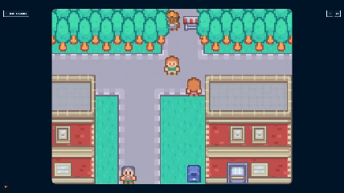

<div align="center">

# Portfolio — YENTEC

Portfolio personnel de YENTEC, développeur web fullstack basé à Fréjus.
Site vitrine one-page : présentation, parcours, services, compétences, projets et contact.


**[Lien](https://yentec.fr)**

</div>

## Stack

| Domaine           | Choix                                                         |
| ----------------- | ------------------------------------------------------------- |
| Framework         | Next.js 16 (App Router, Server Components, Server Actions)    |
| Langage           | TypeScript strict (`noUncheckedIndexedAccess`, zéro `any`)    |
| Styling           | Tailwind CSS v4 (tokens CSS dans `globals.css`)               |
| Animations        | Motion (Framer Motion) — respect de `prefers-reduced-motion`  |
| Internationalisation | next-intl v4 (FR / EN, `localePrefix: "always"`)           |
| Formulaire        | Server Action + validation Zod + envoi via Resend             |
| Tests             | Vitest (schéma Zod, rendu email, parité des traductions)      |
| Qualité           | ESLint, Prettier, CI GitHub Actions                           |
| Déploiement       | Vercel (preview par PR, production sur `main`)                |

## Fonctionnalités

- Responsive mobile / tablette / desktop
- Bilingue FR / EN — routes préfixées (`/fr/`, `/en/`), contenu localisé dans `messages/`
- Thème clair / sombre sans flash au chargement (script anti-flash avant hydratation)
- Micro-animations sobres au scroll (`whileInView`, désactivées si `prefers-reduced-motion`)
- Formulaire de contact fonctionnel — backend réel, anti-spam honeypot, validation Zod
- Mentions légales conformes RGPD (`/fr/legal-notice`) — mesure d'audience anonymisée (Vercel Analytics, sans cookie)
- SEO complet : metadata, OpenGraph dynamique (`next/og`), sitemap, robots.txt, JSON-LD `Person`
- Accessibilité : navigation clavier, anneaux de focus visibles, contrastes WCAG AA, labels ARIA
- **Mode RPG** (`/rpg`) : présentation alternative du portfolio en petit RPG 2D top-down, vitrine technique — voir [section dédiée](#mode-rpg)

## Démarrage

```bash
git clone https://github.com/Yentec/portfolio.git
cd portfolio
npm install
cp .env.example .env          # puis renseigner les variables
npm run dev
```

### Variables d'environnement

| Variable           | Description                               |
| ------------------ | ----------------------------------------- |
| `RESEND_API_KEY`   | Clé API [Resend](https://resend.com) pour l'envoi du formulaire |
| `CONTACT_TO_EMAIL` | Adresse de réception des messages         |

## Scripts

| Commande              | Action                                  |
| --------------------- | --------------------------------------- |
| `npm run dev`         | Serveur de développement                |
| `npm run build`       | Build de production                     |
| `npm run lint`        | Analyse ESLint                          |
| `npm run typecheck`   | Vérification TypeScript (`tsc --noEmit`) |
| `npm test`            | Tests unitaires (Vitest)                |
| `npm run format`      | Formatage Prettier                      |
| `npm run format:check`| Vérification du formatage               |

## Architecture

```
app/
├─ layout.tsx / page.tsx      # Racine : redirect vers /fr
├─ globals.css                # Tokens design system (@theme Tailwind)
├─ opengraph-image.tsx        # Image OG générée dynamiquement
├─ sitemap.ts / robots.ts     # SEO technique
├─ actions/contact.ts         # Server Action — formulaire de contact
└─ [locale]/
   ├─ layout.tsx / page.tsx   # Layout localisé, sections
   ├─ legal-notice/           # Mentions légales (noindex, RGPD)
   └─ rpg/                    # Route du mode RPG (canvas, chargé en dynamique)
components/
├─ layout/    Header, Footer
├─ sections/  Hero, About, Services, Skills, Projects, Discover, Contact
├─ ui/        Button, Badge, ProjectCard, Section
├─ motion/    Reveal (wrapper Framer Motion)
├─ email/     Template HTML du mail de contact
└─ rpg/       GameCanvas, DialogueBox, GameUI, MobileControls, IntroSequence, ModeTransition, LocationBanner
content/      Profil, services, compétences, projets — données structurées typées
└─ rpg/       npcs.ts, secrets.ts — PNJ et easter eggs positionnels du mode RPG
messages/     fr.json / en.json — contenu localisé (textes UI + projets + études de cas + dialogues RPG)
i18n/         routing.ts — configuration next-intl (locales, prefixe)
lib/          ThemeProvider, validation d'env (Zod), utilitaires
└─ rpg/       engine.ts, map.ts, player.ts, npc.ts, camera.ts, render.ts, audio.ts, input.ts, secrets.ts, constants.ts
types/        Types partagés (+ rpg.ts pour le domaine RPG)
```

Le contenu est découplé du rendu : ajouter un projet nécessite `content/projects.ts` + les entrées correspondantes dans `messages/fr.json` et `messages/en.json`.

## Mode RPG

Présentation alternative du portfolio (`/rpg`) : un petit village en 2D top-down où chaque PNJ représente une section du site (À propos, Services, Compétences, Projets, Contact). Vitrine technique — le mode classique reste la référence, aucun contenu n'est accessible uniquement via le RPG.



### Choix techniques

- **Canvas 2D fait main, pas de moteur de jeu** (Phaser, Pixi…) : bundle plus léger, et la game loop (`requestAnimationFrame`, mouvement, collisions) est écrite à la main plutôt que déléguée à une lib — démonstration volontaire de la mécanique plutôt qu'un choix de facilité.
- **Rendu par tuiles** : grille logique en 16px (`TILE_SIZE`, natif à l'atlas Kenney), affichée à l'échelle ×3 (`RENDER_SCALE`) avec `imageSmoothingEnabled = false` pour un pixel art net. Carte en 3 couches (sol, décor intermédiaire, premier plan) + grille de collision booléenne parallèle.
- **Isolation du bundle** : `lib/rpg/`, `components/rpg/` et `content/rpg/` sont chargés via `next/dynamic(..., { ssr: false })` — le mode classique ne télécharge ni n'exécute aucun code RPG au chargement.
- **Accessibilité multi-input** : clavier (flèches, WASD/ZQSD, Entrée/Espace/Échap) et tactile (D-pad + boutons A/B) pilotent la même logique d'interaction ; `prefers-reduced-motion` désactive les animations non essentielles (transitions, idle des PNJ, machine à écrire des dialogues).
- **Audio natif** : Web Audio API directement (pas de lib son), muet par défaut (politique des navigateurs + confort), activable via le HUD.

Pas de commande dédiée : le mode RPG fait partie de la même application Next.js, `npm run dev` / `build` / `test` couvrent les deux modes.

### Crédits des assets

Voir [Crédits](#crédits) ci-dessous.

## Licence

Code sous licence MIT. Le contenu textuel et les visuels restent la propriété de YENTEC.

## Crédits

### Assets — Mode RPG

- **RPG Urban Pack** (tileset) by [Kenney](https://kenney.nl/assets/rpg-urban-pack) — [CC0 1.0 Universal](https://creativecommons.org/publicdomain/zero/1.0/)
- **RPG Audio** (bruitage pas) by [Kenney](https://kenney.nl/assets/rpg-audio) — [CC0 1.0 Universal](https://creativecommons.org/publicdomain/zero/1.0/)
- **Interface Sounds** (bruitage ouverture dialogue) by [Kenney](https://kenney.nl/assets/interface-sounds) — [CC0 1.0 Universal](https://creativecommons.org/publicdomain/zero/1.0/)
- **My Little Corner of the World** (musique de fond) by [Fablefly Music](https://fablefly-music.itch.io/my-little-corner-of-the-world) — libre d'usage personnel et commercial, **crédit obligatoire** (condition de la licence, pas seulement une bonne pratique)